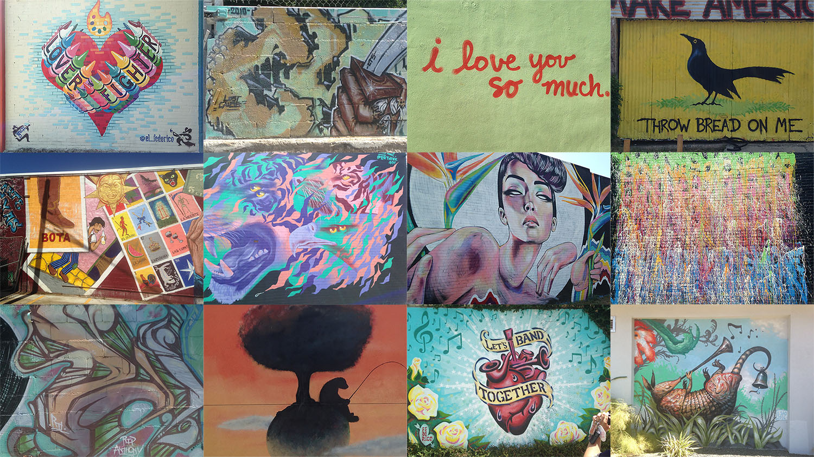
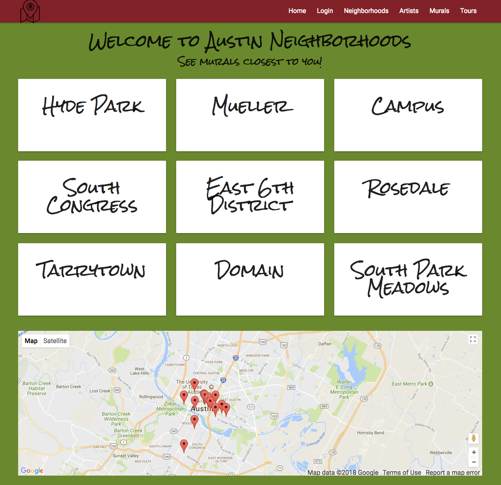
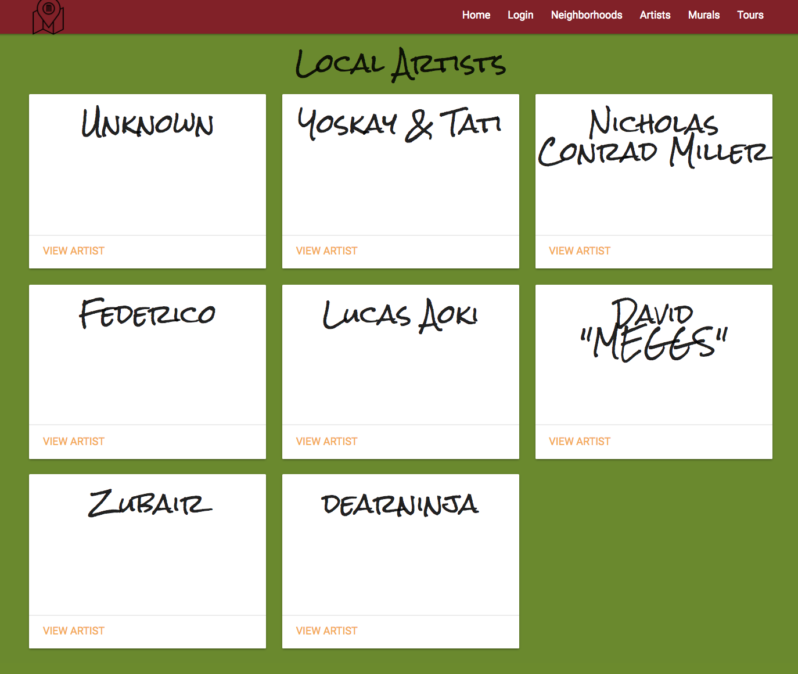
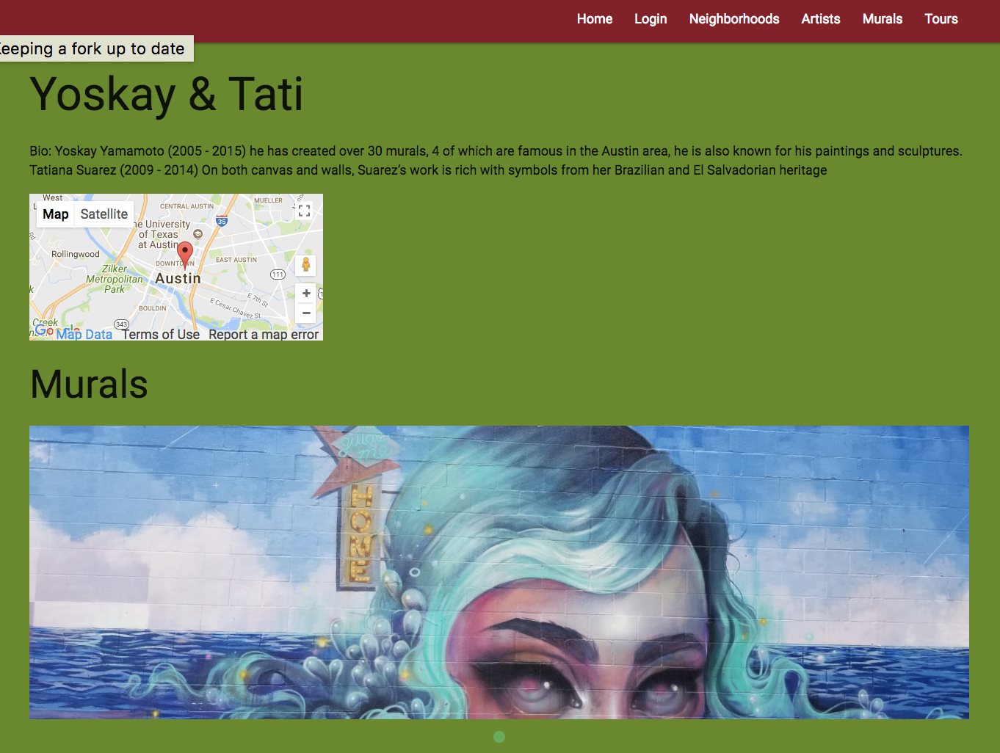
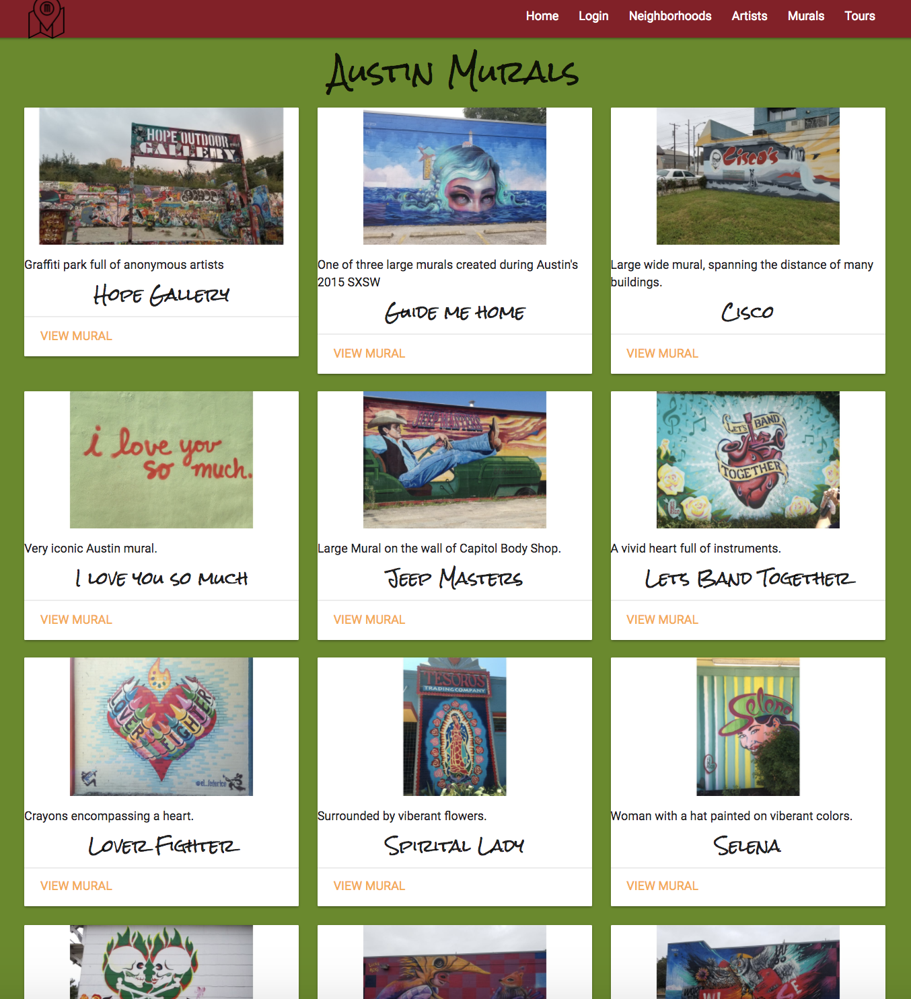
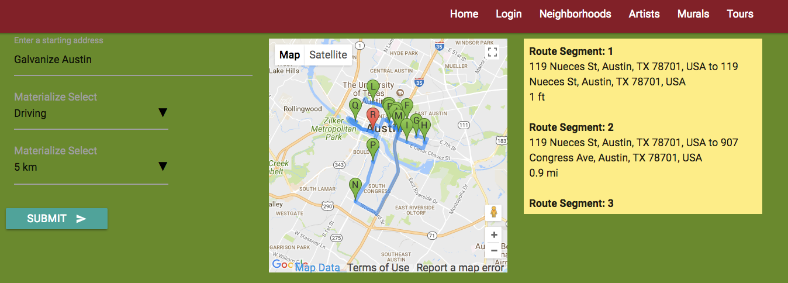

# Murality Austin
Murality Austin is an interactive web application designed to help locals and tourists in the Austin area find and share cool, interesting murals and urban artwork

## Background
This application was our second quarter project in the Galvanize Fullstack Web Development immersive program and was completed over the course of one week.

The team consisted of:
* [Ryan Wittrup](https://github.com/wittrura)
* [Peter Sarkis](https://github.com/Turbulence9)
* [John McCambridge](https://github.com/nol166)
* [Jayme Ramsay](https://github.com/jaymeramsay)

## How it Works
The application uses the ejs templating engine to render all views. Users are able to register and sign in via Bcrypt, which provides a different experience from non-authenticated users.

Authenticated users are able to create new entries for artists or murals, or add new photos which are stored using the Cloudinary API.

All users are also able to plan visits to the different murals using the Google Maps Directions API and setting distance fences or transit methods.

### Inspiration
Austin is a city known for its vibrant creative and artistic communities. This is made especially clear in the many murals and graffiti installments across the town. Some are large, commissioned works while others may be small and only noticed after a close inspection of a building.

We love to keep it weird here, so we thought there should be a better way to share and experience some of that weird.

## Challenges
* Photo storage - We initially reviewed storing images locally and experimented using BLOB's in PostgreSQL and file paths. This was difficult to use in the ejs templates, and it was decided to instead use a hosted service like Cloudinary which would provide links that could be better included in anchor and img tags.

* Mural Photo Removal - The way we generated an array of photo images for the photo slides was not initially built to support photo removal. To fix this the code was later refactored to all any photo in the list to be removed as well as a default photo when the array of images became empty.

* Local image to Cloudinary upload - The Cloudinary gui upload process was very slow and cumbersome. To fix this we used the Cloudinary library library and javascript file system library to upload all the images in a designated folder. This required the use of Promise.all the ensure all the images had been uploaded before proceeding.

* Routing and directions planning - We had to find a way to search for directions based on a user giving a max distance they would want to travel. Given the limit of 23 waypoints in the Directions API, we decided to first run all murals through the Distance Matrix API to reduce to a list of murals meeting the distance requirement. We could then feed that into the Directions request.

* Git versioning and general team management - this was our first team product and it took a few days to start getting comfortable with the workflow. It took a few rejected PR's but the team settled in and the process was much smoother towards the end of the project.

## Features
* As a user, I can safely register and sign in to get the full accessibility of the site
* As a user, I can create, read, update, and delete entries for artists and murals to share new discoveries
* As a user, I can upload an image of a mural so it can be searched by browsing through neighborhoods or artists
* As a user, I can plan tours to different murals so I can visit any sites that look interesting

##### Neighborhoods Page

##### Artists Page

##### Artist Page

##### Murals Page

##### Tours Page

## Built With
* [Node](https://nodejs.org/en/) - Backend server
* [Express](http://expressjs.com/) - Backend server, routing, middleware
* [Knex](http://knexjs.org/) - SQL query builder
* [PostgreSQL](https://www.postgresql.org/) - SQL database
* [Bcrypt](https://github.com/kelektiv/node.bcrypt.js) - encryption for user login
* [Google Maps](https://developers.google.com/maps/) - navigation and route planning
* [Cloudinary](https://cloudinary.com/) - cloud image storage
* [Materialize](http://materializecss.com/) - UI, layout, and styling framework
* [Heroku](http://www.heroku.com) - used for deployment

## Authors
* **Ryan Wittrup** - [Github](https://github.com/wittrura), [Personal Site](http://www.ryanwittrup.com/)
* **Peter Sarkis** - [Github](https://github.com/Turbulence9)
* **John McCambridge** - [Github](https://github.com/nol166)
* **Jayme Ramsay** [Github](https://github.com/jaymeramsay)

<!-- ## Acknowledgments -->
